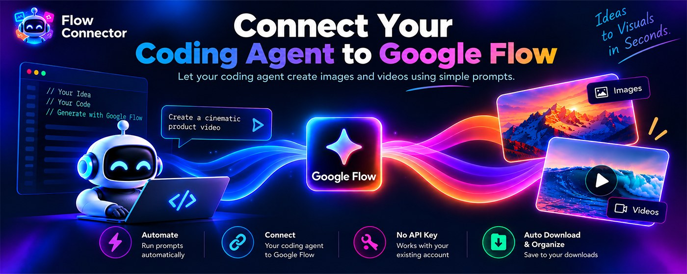
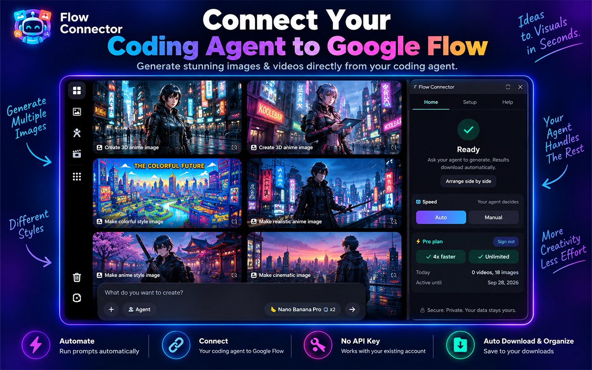
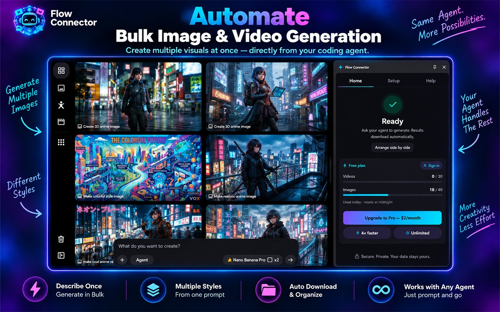
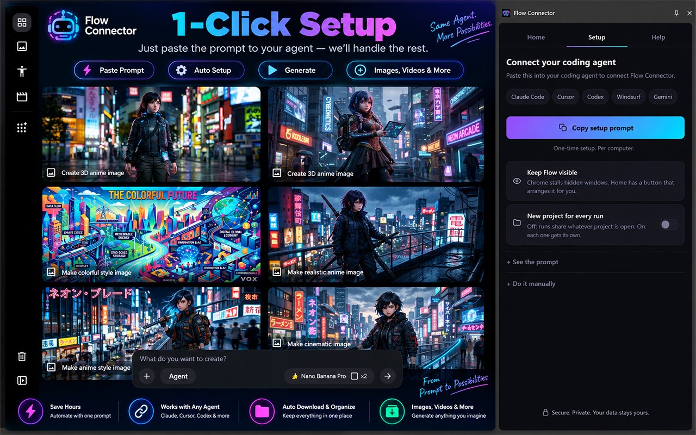
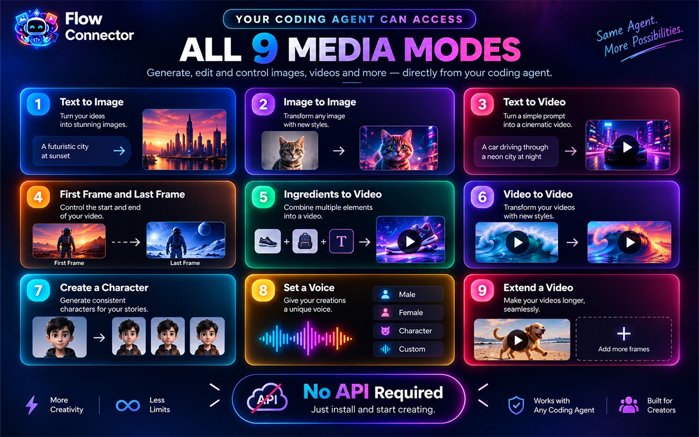
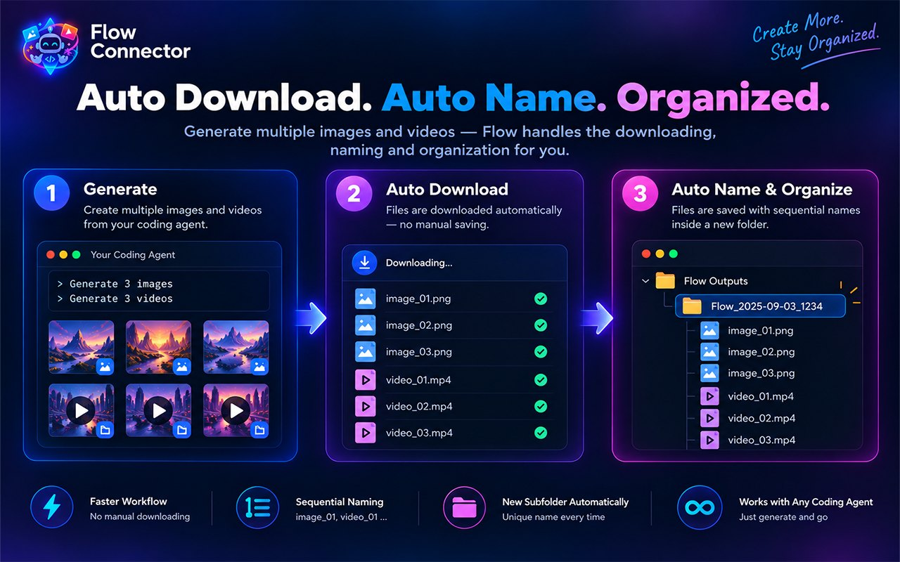

# Flow Connector



**Connect your coding agent to [Google Flow](https://flow.google.com)**
Ask it to create images and videos the same way you ask it to write code.

You can also use it on its own. Give it a list of prompts and it works through
them automatically, generating each result and saving the finished files to your
Downloads folder while you do something else.



## Why you'd install it

Creating images and videos one by one takes time and a lot of repetitive work.
Flow Connector automates that process: add your prompts once and it handles the
generation and the downloads.

It also gives your coding agent access to image and video generation, so your
agent can create visual assets when your project needs them.

- Let your coding agent generate visual assets when your project needs them
- Queue a list of prompts and let them run automatically
- Generate variations and assets in batches
- Images and videos download as soon as they're ready
- Files are saved with clear, readable names
- No API key is required — it works with your existing Google Flow account



## How the agent connection works

Open the extension, copy the setup prompt, and paste it into your coding agent
once. The extension sets up the connection automatically using a small local
helper — a skill for Claude Code, an MCP server for everything else.

After that you just say what you want:

```
> generate 20 product images and 5 promo videos, in different styles
```

The connection runs locally on your computer. Your prompts and files do not pass
through a server operated by us.



**You don't need a coding agent.** The side panel handles everything on its own
if you prefer to enter prompts yourself.

### Which agents this works with

There are only two integrations, and the second one is a standard:

- **Claude Code** gets a native skill — `grok-auto skill install flow-generate`,
  which lands in `~/.claude/skills/` and every project sees it.
- **Everything else** registers `grok-auto-mcp`, a plain stdio MCP server. Most
  agents take it as:

  ```json
  { "mcpServers": { "flow-connector": { "command": "grok-auto-mcp" } } }
  ```

So the question is rarely *whether* an agent works — if it speaks MCP, it does —
but where its config file lives. The setup prompt figures that out by asking the
agent itself, which knows better than a dropdown would.

| Agent | Connects via | Config it usually writes |
|---|---|---|
| Claude Code | native skill | `~/.claude/skills/` |
| Cursor | MCP | `~/.cursor/mcp.json` |
| Codex | MCP | `~/.codex/config.toml`, or `codex mcp add` |
| Gemini CLI | MCP | `~/.gemini/settings.json`, or `gemini mcp add` |
| Windsurf | MCP | `~/.codeium/windsurf/mcp_config.json` |
| Anything else that speaks MCP | MCP | wherever that agent keeps user-level servers |

**Verified end to end on Claude Code.** The rest are ordinary MCP clients and
there is nothing unusual for them to trip over, but they have not each been sat
down and tested, and this page would rather say so than pretend. If one of them
misbehaves, [open an issue](https://github.com/srijan-kaiwart/flow-connector/issues/new)
— that is a bug worth fixing, not a limitation.

Use your **user-level** config, not a per-project one, so the connection follows
you between projects. The setup prompt asks for that explicitly.

## What you can make

Flow Connector supports Flow's available generation modes, including:



The available models depend on what Google Flow makes available to your account.



## What generating costs

Flow Connector does not charge you per image or video.

Generation happens through your own Google Flow account and uses the credits and
limits provided by Google. The extension simply automates the workflow around
Flow.

## How it works

Flow Connector works with the real Flow interface in your browser, using the
Google account you are already signed into.

**One thing to know before you install:** the Flow tab itself has to stay open
and visible on screen while a run is in progress, on Pro as well as Free. Chrome
slows down windows that are minimised or covered, which would stall the
generation. The extension has a button that arranges the browser next to your
editor in one click.

Because it works through the actual Flow interface, Flow's own usage limits and
content rules still apply. The extension does not provide additional credits or
bypass those limits.

## Free and Pro

**Free** — a daily allowance of images and videos, one prompt at a time, with
the extension panel open while it works. The current limits are shown in the
panel and reset each day.

**Pro** — faster generation, unlimited images and video, and you can close the
extension panel and leave a run going. The price is shown in the extension
before you pay, and it is a fixed period paid once: nothing renews on its own
and no payment details are stored.

On both plans the Flow tab itself still has to stay open and visible. Closing
the panel is not the same as running in the background.

Every model and every mode works on both plans. Nothing is held back.

## Privacy

Your prompts and generated files stay between your browser and the services you
choose to use.

We do not use analytics, advertising, or tracking to monitor your activity. The
extension does not send your prompts or generated media to our servers.

The one exception is a licence check, and only if you sign in to a paid plan. It
sends your email address and a random installation id so the plan can be
confirmed, and nothing else. Free users never send even that. Full policy:
<https://flow-connector.flowconnector.workers.dev/privacy>

## Install

From the Chrome Web Store — the listing is in review. This repo is the support
channel and the home of the [agent skill](skills/flow-generate/SKILL.md) and the
docs; the extension itself ships through the store.

## Something broken?

[Open an issue](https://github.com/srijan-kaiwart/flow-connector/issues/new).
Flow changes its interface fairly often and that is usually what breaks
automation, so the extension's Help tab fills most of the report in for you —
version, what the automation was doing, and where it stopped. Paste that in and
it is usually enough to find the problem.

## Press kit

Everything on this page, at full resolution, is in the store listing. The
extension's own mark:


## Not affiliated with Google

Flow Connector is an independent tool and is not affiliated with, endorsed by,
or sponsored by Google LLC.

Google product names are used only to describe compatibility. Automating a
website may be subject to that website's terms of service, so please use the
extension responsibly.
